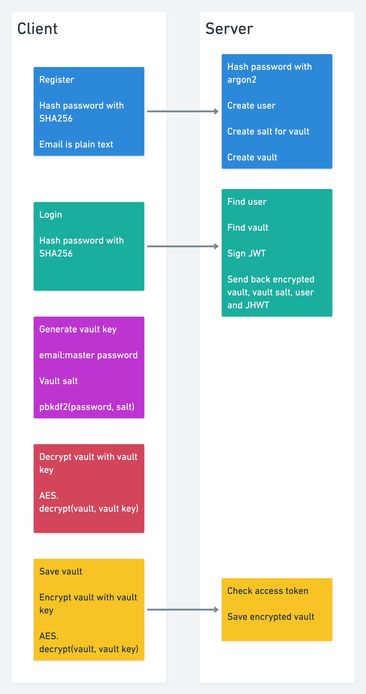

# Password manager

## What will you learn?
* Various hashing and encryption strategies
* How password managers work
* Basic React.js
* Basic TypeScript

## Video structure
1. Application demo
2. Code walk-through
3. Server setup
4. Client setup
5. User registration
6. user login
7. Vault management

## Hashing vs encryption
* Hashing is one way - Hashed data can not be unhashed, it can simply be hashed again and compared.
* Encryption is two way - Encrypted data can be decrypted if you know the correct string/ key.

## Algorithms used
* SHA256 - Predictable password hash
* Argon2 - Unpredictable password hash for the database
* pbkdf2 - Generate the vault key
* AES256 - Encrypt and decrypt the vault

## Data flow
